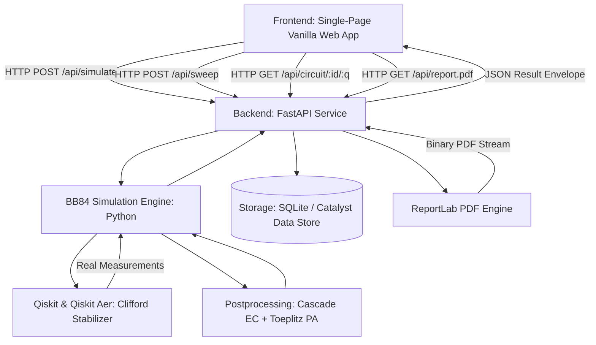

# System Architecture & Technical Specifications

## Layered Component Breakdown

### 1. Quantum Simulation Substrate (`backend/bb84/`)
- Pure Python execution orchestration backed by IBM Qiskit and Qiskit Aer.
- Uses Clifford stabilizer simulation (`method="stabilizer"`), permitting exact, deterministic state reduction and measurement sampling across thousands of qubits in milliseconds.
- Simulates natural channel noise via Qiskit's `NoiseModel` with Pauli depolarizing and bit-flip errors targeting optical transit `id` gates.

### 2. Cryptographic Post-Processing Pipeline (`backend/bb84/postprocess.py`)
- **Sifting Stage:** Bitwise comparison of Alice and Bob basis choices, discarding mismatches.
- **Parameter Estimation:** Random public sacrifice of sample bits (configurable fraction $\approx 25\%$) to measure sample QBER.
- **Cascade Error Correction:** Four-pass multi-layer binary search parity reconciliation with bidirectional backtracking, correcting residual channel errors while strictly accounting for leaked information.
- **Privacy Amplification:** Toeplitz matrix hashing ($m \times n$ binary multiplication mod 2), compressing the key according to $m = n(1 - h_2(Q)) - \text{leak}_{\text{EC}} - \text{safety}$.
- **One-Time-Pad Vernam Demo:** Hardware-level XOR encryption validating end-to-end usable key utility.

### 3. Application Programming Interface (`backend/api/`)
- High-throughput asynchronous endpoints using FastAPI and Pydantic v2.
- Clean session-less and session-backed architectures supporting single runs, step debugging, multi-seed sweeps, and parallel comparative batches.

### 4. Presentation & Visualization Layer (`frontend/`)
- Single-page vanilla HTML5, CSS3, and JavaScript modules.
- Strict adherence to the `.agents/skills/no-ai-look-ui/SKILL.md` research instrument aesthetic.
- Zero external runtime JavaScript frameworks (no React, no Vue, no Tailwind, no bundlers) ensuring ultra-fast load times and seamless zero-configuration deployment on Zoho Catalyst AppSail.
